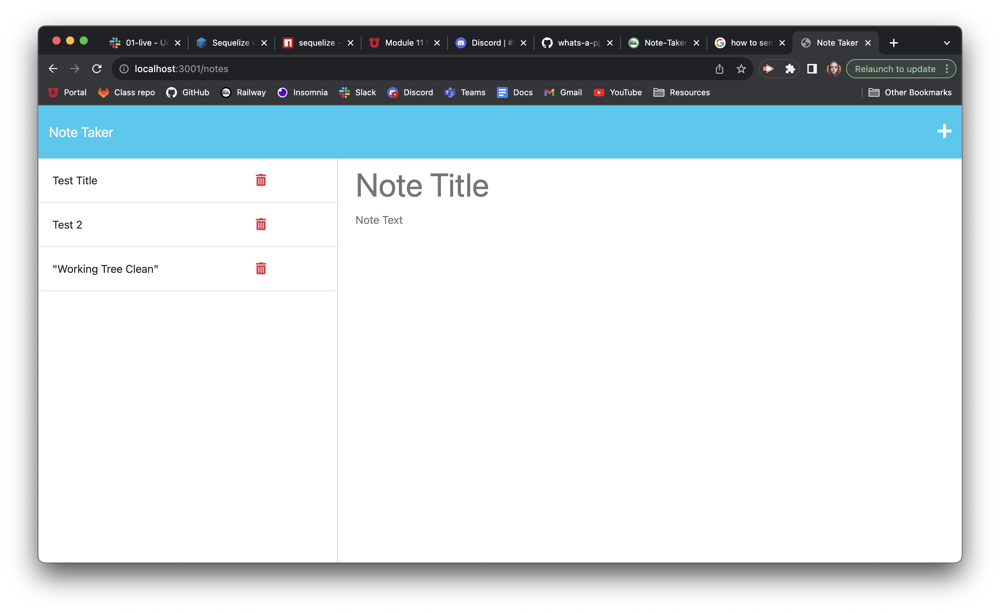
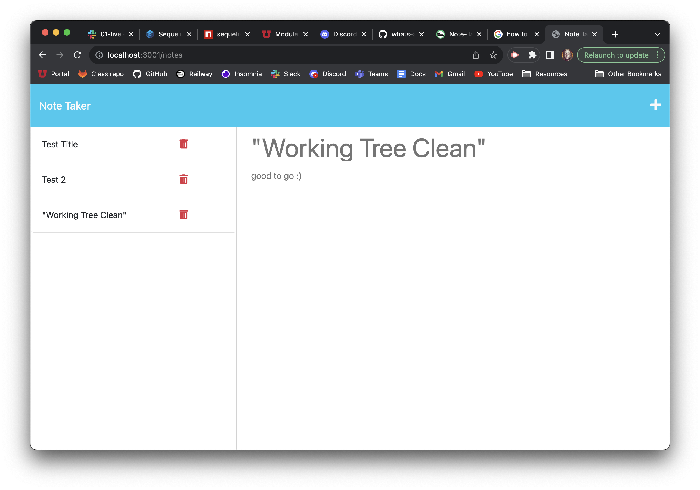

# Note-Taker-Express.js
An application that can be used to write and save notes. This uses an Express.js back end that will save and retrieve note data from a JSON file. You can use this for grocery lists, to-do lists, quick notes to look back at later or general reminders.

## Table of Contents
* [Installation](#installation)
* [Additional Information](#additional-information)

## Installation
- This needs to be run on your local machine

- After cloning this repo down locally, make sure you have node and express downloaded

- Then if you have nodemon installed you can run nodemon server.js or if you do not have nodemon, just node server.js and that should start up your server 

- Open a new tab on your web browser and type in "localhost:3001" and the application will be there

- Add as many notes as you like!

## Additional Information

> ### Repository Owner: P.J. Rasmussen ([whats-a-pj](https://github.com/whats-a-pj)) 

 Screenshot of Site & Repo Links 

Railway Link: https://railway.app/project/813c7006-7941-4e8b-9acc-415e502c3cb3

Home page

After you click on a saved note

 Process Summary 

Downloaded starter code

Spent time researching Express and re-watching class zoom links

Set up routes and files in a way that made sense to me

Looked up docs on UUID for unique ids

Updated README & Deployed site

 Credits 

These are the websites I used including the starter code repo

https://github.com/coding-boot-camp/miniature-eureka

https://expressjs.com/en/guide/routing.html

https://expressjs.com/en/guide/routing.html#express-router

https://expressjs.com/en/starter/static-files.html

https://gist.github.com/alexpchin/102854243cd066f8b88e

https://www.youtube.com/watch?v=MpuF4uPopWI

https://www.youtube.com/watch?v=SccSCuHhOw0

https://nodejs.dev/en/learn/nodejs-file-paths/

https://stackoverflow.com/questions/34329149/nodejs-absolute-paths-in-windows-with-forward-slash

https://www.npmjs.com/package/uuid

https://www.geeksforgeeks.org/node-js-fs-readfilesync-method/

I had a study group with Brian Whisler, Jeremy Rapich and Salvador Mejia on 9/3 where we went over Express.js and a bit of SQL.

Also had help from TA's CJ Sanders, Trever Oveson and Jacek Hacking, surprised to find out all I really needed to do was change a single line of code to get everything up and running!

